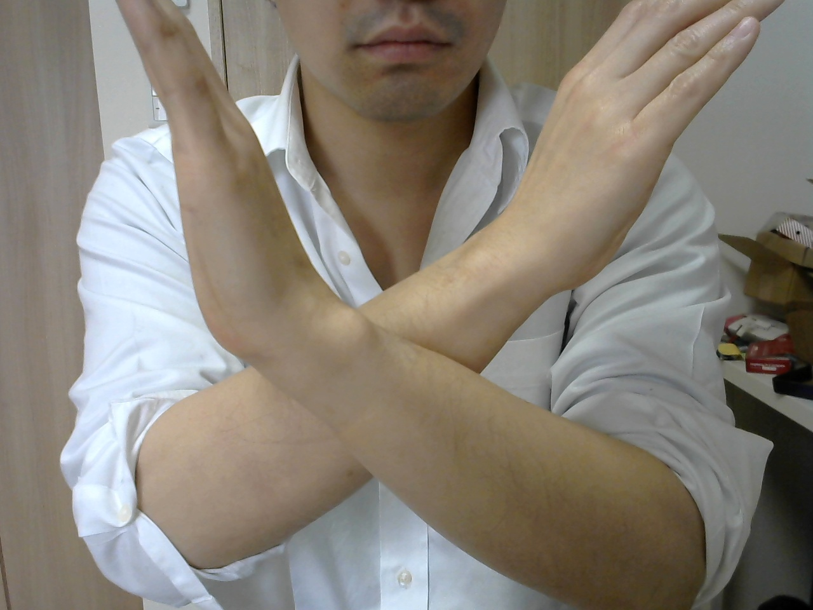
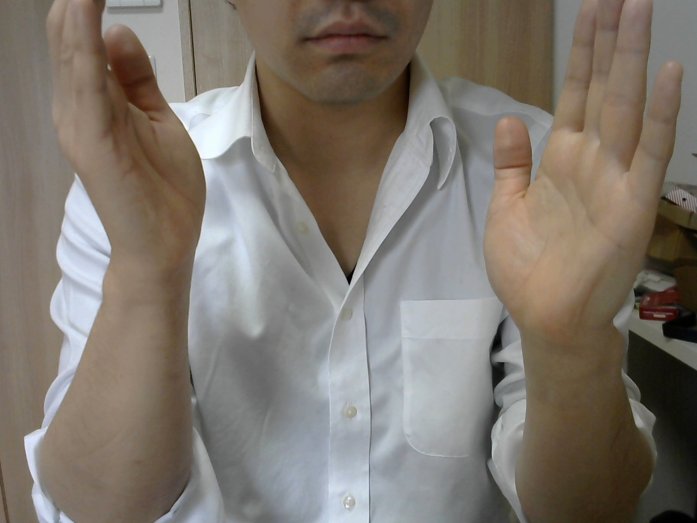
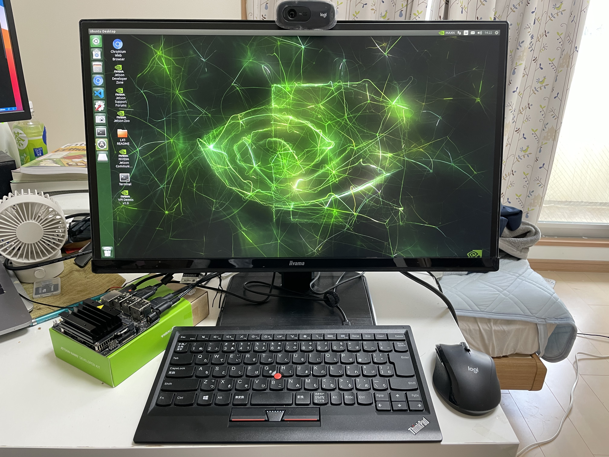
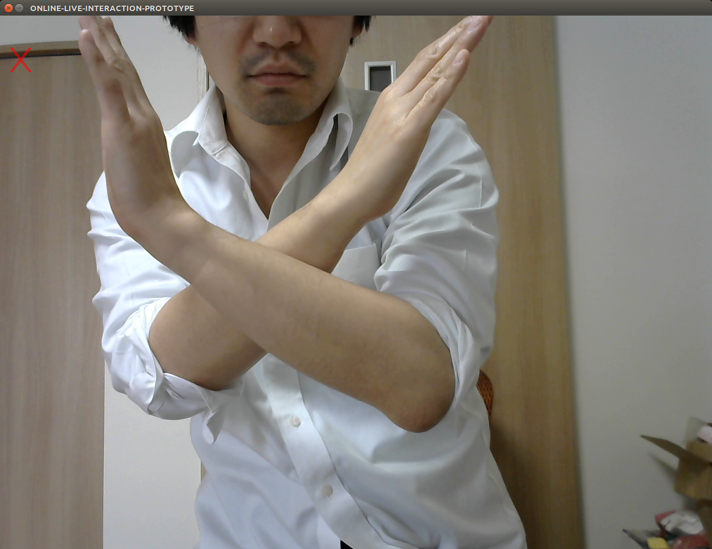
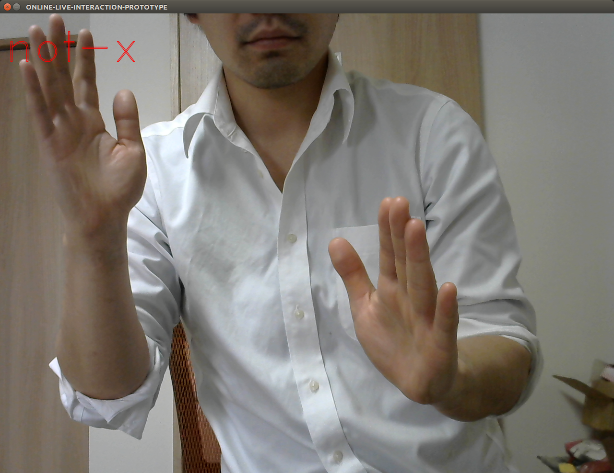
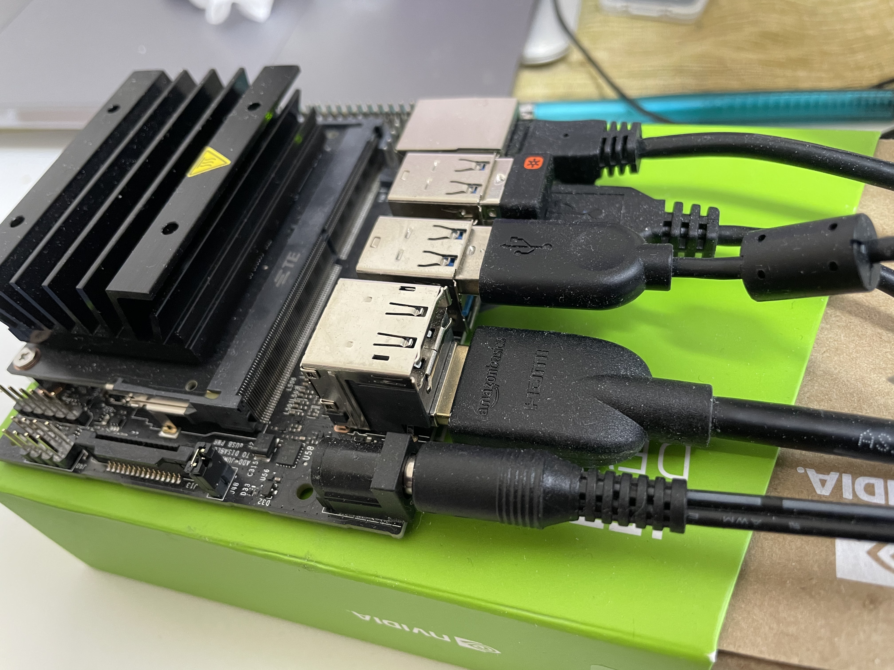

# Project Name
ONLINE LIVE INTERACTION PROTOTYPE with NVIDIA Jetson

# Overview
Live and entertainment industry has faced difficult time because of COVID-19. So, artists have sterted online live more. Because they can't host live at real site. On real site live, artists and audiences enjoy the live by interaction, for example, call and response. However, online live, artists and audiences can't have any interaction, it makes live feeling some kind of lacks. That's the issue definition of this project. To solve the issue, I aim to develop artists and audiences interaction system. In this project, I propose a system of interaction system that edge device recognizes arm gesture from audience by USB camera and notifys it to cloud server and artists. In this time, we develop prototype of one. In this prototype, edge device recognizes arm gesture from person and plays YouTube video. Edge device is NVIDIA Jetson Nano with DNN model of AI recognizing arm gesture. By this prototype artists and audience interaction system described above can be.

# Prototyping
In this prototype, I'm describing the billboard charted artist [Babymetal](https://en.wikipedia.org/wiki/Babymetal) as online live example. For this project, I pick up the song [Ijime Dame Zettai](https://en.wikipedia.org/wiki/Ijime,_Dame,_Zettai) that has interaction between artists and audiences. The interaction is "During the chorus, the three members jump and cross their arms into an "X", while shouting "Dame!" (No!) with their hands as kitsune signs" that is quoted from [the wikipedia page](https://en.wikipedia.org/wiki/Ijime,_Dame,_Zettai), audiences do the same arm gesture. It is called "Dame Jump". It makes live heating up! In this prorotype, I make DNN model of AI calassifying "X" arm gesture or not by learning, and deploy it to NVIDIA Jetson Nano to do inference arm gesture and play the YouTube video [Ijime,Dame,Zettai - Live at Sonisphere 2014,UK (OFFICIAL)](https://www.youtube.com/watch?t=117&v=Ro-_cbfdrYE&feature=youtu.be).

# AI model and Training of Deep Learning
- Base DNN model : Simple MNIST convnet
- Number of training data : Over 200 photos each arm gesture  (X or NOT-X)
- Training epoch : 20

I tarined my model by condition above. Examle training data are below.




First one is training data for X. Second one is training data for NOT-X. I tarained my model on [Google Colab](https://colab.research.google.com/notebooks/) with Keras and TensorFlow running on GPU.

# Edge System
- Hardware<br>
Edge device is NVIDIA Jetson Nano, and video source is USB Camera of Logitech C270.

- Sosftware<br>
Inference framework is Kras and TensorFlow running on GPU. When the DNN model calassifies video source as "X", browser is launched and played the YouTube Video.

Picture of the edge system is here.



# Demo 
There is [FULL VIDEO]((https://youtu.be/96_-Ljowg5E)) the Edge system running. In this video, I select [NVIDIA Hottest Announcements at NVIDIA GTC 2020 October](https://youtu.be/CKnipnFsuFo) instead of [Ijime,Dame,Zettai - Live at Sonisphere 2014,UK (OFFICIAL)](https://www.youtube.com/watch?t=117&v=Ro-_cbfdrYE&feature=youtu.be), because of copyright. Pictures doing inference are as follows. Fist one is X, second one is NOT-X.




# Setup to Run
- Jetson<br>
Prepareing hardwares are as follows and Connecting them like a picture.<br>
・Jetson Nano<br>
・USB Camera<br>
・Display<br>
・Keyboard<br>
・Mouse<br>
・Wired LAN Cable<br>
・Power Supply<br>


- JetPack4.5<br>
JetPack 4.5 is [here](https://developer.nvidia.com/embedded/jetpack). Downloading For "Jetson Nano Developer Kit" Version and installing it through the [instruction](https://developer.nvidia.com/embedded/learn/get-started-jetson-nano-devkit#write).

- Installing TensorFlow<br>
Installing TnsorFlow through the [instruction](https://docs.nvidia.com/deeplearning/frameworks/install-tf-jetson-platform/index.html).

- Get and Run the Project<br>
Launching a bash terminal.
```
git clone https://github.com/thatoshi/ONLINE-LIVE-INTERACTION-PROTOTYPE.git
cd ONLINE-LIVE-INTERACTION-PROTOTYPE
./liveInteraction.sh https://www.youtube.com/watch?t=117&v=Ro-_cbfdrYE&feature=youtu.be
```

- Appendix<br>
If you want to play any other YouTube video, you can change the parameter of ./liveInteraction.sh like follows.
```
./liveInteraction.sh "Any of YouTube URL you want to play"
```


# Acknowledgments
I've learned AI from this [book](https://www.amazon.co.jp/dp/B08R632HML/).